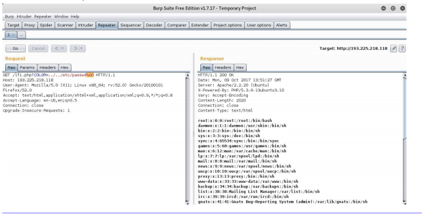
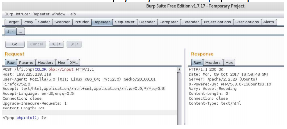
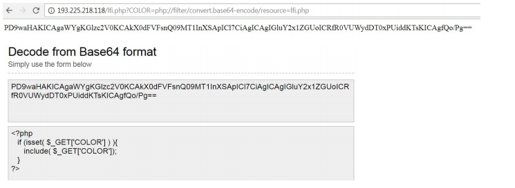
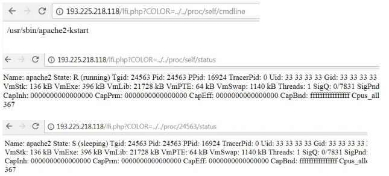
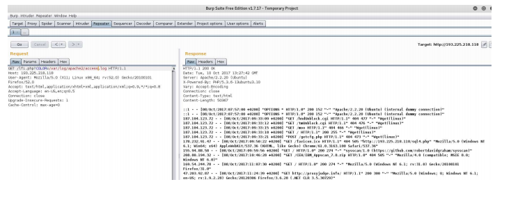
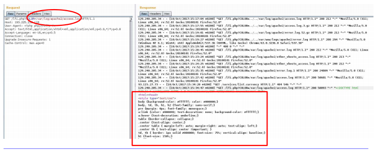

# Sql injection, Xpath injection, Server side template injection, File inclusion.
date: 08.10.19

## SQL
Dynamic websites can use large amounts of data. One of the most popular ways of storing data is in relational databases.

## SQL injection
The core of SQL injection is craft a input that creates a unintended (from the defenders perspective)successful SQL query

### Simple SQL injection
The easiest case of SQL injection is when we have a direct influence on an action. Normally the attacker have to face a complex exploitation. Usually the attacker has only indirect influence on the website action.


### Types of SQL injections

#### Boolean based bind
The attacker provides a input and observes the website answer. The answer is either page 1 or page 2 (only two options). There is no direct response to the attackers query but it is possible to play a true and false game using the two different responses. THe difference between the two responses can be only one byte or totally different pages.

**Attack example**
An attacker can complete SQL statements that resolves to information about the database. The information is not shown on the page but using comparisons and many queries information can be retrieved.

I addition true or false queries can have different response time that can be exploited to gain information.

#### Error based
The attacker forces syntactically wrong queries and tries to map the
database using the data provided by the error messages.


#### Union query

The attacker takes advantage of the SQL UNION SELECT statement. If the attack er can intervene to the sql query then he can append it to a union select and form the second query almost freely.

#### Stacked query

If the SQL engine supports stacked queries (first query; second query; etc) then in case of a vulnerable parameters the attacker closes the original query with a semicolon and writes additional queries to obtain the data.

#### Time based bind

It is the same as the boolean based, but instead of having two different web responses the difference is the response time (less trustworthy)

### Other options
SQL vulnerabilities can be be used for other attacks than directly against the database.

#### Reading local files

#### Writing local files
With the SELECT INTO OUTFILE command the attacker can write local files.

#### Executing OS commands
In some cases the db engine has the right to execute OS level commands.

### SQL injection filter evasion techniques

- White space or  'a'='a'
- Null bytes %00 UNION SELECT password FROM Users WHERE username='admin'--
- SQK Comments
    '/**/UNION/\*\*/SELECT/\*\*/password/\*\*/FROM/\*\*/Users/\*\*/WHERE/\*\*/name/\*\*/LIKE/\*\*/'admin'--
- URL encoding
    %27%20UNION%20SELECT%20password%20FROM%20Users%20WHERE
%20name%3D%27admin%27--

- Character encoding
    ' UNION SELECT password FROM Users WHERE
name=char(114,111,111,116)--

- String Concatination EXEC('SEL' + 'ECT 1')

- Hex Encoding SELECT user FROM users WHERE name = unhex('726F6F74')

## Xpath injection
Instead of storing datasets in databases, data can be stored in xml format.

### Xpath query with PHP

Xpath can be used to make a query, e.g finding the full name of the user whose username is john and the password is imagine:

```php
$xml->xpath("/users/user[name='john' and password='imagine']/fullname")
```

Finding the first user in the database
```php
$xml->xpath("/users/user[position()=1]/fullname")
```

Finding the penultimate user
```php
$xml->xpath("/users/user[last()-1]/fullname")
```

Other xpath functions can be used as well.
```php
last(), count(node-set), string(), contains(), etc 
```

The full xpath reference is here:
https://docs.oracle.com/cd/E35413_01/doc.722/e35419/dev_xpath_functions.htm

### Xpath injection
Xpath injection is possible when there is no input validation or the validation is inappropriate in the xpath query.

**Note: The exploitation of the vulnerability looks like and SQL injection exploitation.**

Tutorial for xpath injection: http://securityidiots.com/Web-Pentest/XPATH-Injection/xpathinjection-part-1.html

https://media.blackhat.com/bh-eu-12/Siddharth/bh-eu-12-Siddharth-Xpath-WP.pdf


## Server Side Template Injection (SSTI)
Template engines are widely used by web applications to present dynamic data via web pages. Unsafely embedding user input in templates enables Sever-Side Template Injection. Example:

```php
$output = $twig->render("Dear {first_name},", array("first_name" => $user.first_name));
```

If a user input is substituted as template parameter without proper validation then the vulnerability appears.

```php
$output = $twig->render($_GET['custom_email'], array("first_name" => $user.first_name));
```

After detecting the vulnerability the next step is to identify the template engine that was used (e.g Smarty, Twig, Jade). Each template engine has specific exploitation. In case of a successful exploitation the attacker can even execute arbitrary shell commands.

More details can be found here: https://portswigger.net/blog/server-side-template-injection

## Local file inclusion
*Really dangerous*

Local File Inclusion (LFI) is a vulnerability when the attacker can include a local file of the webserver using the webpage. If the server side script uses an include file type of method and the input for the method is not validated then the attack can provide a file name that point to a local file

Example: Getting the webpage to show the /etc/passwd file

### Exploitation of the LFI vulnerability
Adding null character to the end of the directory sometimes works when the normal exploitation fails



In addition to obtaining local files an additional aim is to upload attack scripts to execute commands.

Depending on the server and the php setting executing php scripts can be possible if the local file is the: **php://input** and the php script is the posted data:



In other cases providing except as file will execute the desired OS
command, e.g.: `http://193.225.218.118/lfi.php?COLOR=expect://ls`

### Exploitation of the LFI vulnerability - Encoding

A pgp script source cannot be obtained through a browser, because the script is executed on the server side. But using encoding and **php://filter** as input the server side script can be obtained to. Since php 5.0.0 the php://filter/convert.base64-encode/resource function is enabled. It encodes
the php file with base64 and the php script source reveals.



### Exploitation of the LFI vulnerability - advanced

THe most frequently used way of writing files to the server is to write the script in a local file first, then read it back through the LFI vulnerability. How an the attacker place hos own attacking script in a local file?

One option is to access the `/proc/self`linux folder

`/proc/sef/environ`contains the current process info including the HTTP_USER_AGENT. If the attacker places the attacking script inside the user agent of the HTTP header and the webserver has the right to access the `/proc/self/environ` then he can execute any OS command in the name of the webserver application.

*Note! DO not run the webserver as root! If the webserver is compromised and can be forced to execute commands then the command has the same rights as the server (the code is executed in the name of the server).*

IF the environ file is not accessible by the webserver then the attacker can try to find the webserver processid and access the environ file thorough the processid.



The attacker can also try to find the user agent by `/proc/self/fd` and brute-forcing the number (usually 12 or 14 in the case of Apache).

```
/proc/self/fd/12
/proc/self/fd/14%00
/proc/self/fd/12
/proc/self/fd/14%00
/proc/<apache_id>/fd/12
/proc/<apache_id>/fd/14 (apache id is from /proc/self/status)
/proc/<apache_id>/fd/12%00
/proc/<apache_id>/fd/14%00 
```

If the logs are accessible through the web server then the attacker can place the attacking PHP script in the logs to be executed in the same way as in the case of the `/proc/self` folder. THe logs can be in various places, one option is to check /var/log/apache2 folder:



The attacker can influence the source IP, the web method, the HTTP version, the URL and the browser data in the logs. THe easiest way is to modify the browser data (type of browser), because it is a string, so php functions such as system() and phpinfo() can be substituted:



In this way the attacking script can be uploaded. If the log file is too long the browser will note be able to display the logs.


## Remote File Inclusion

If the PHP settings allow, remote files can be inserted to the page. PHP settings relevant to remote inclusion:
- allow_url_fopen: open file with fopen
- allow_url_include: include, include_once_, require, require_once

If the attacker can include remote files he will be able to include attacking scripts that are stored on an attack controlled web server.


## Web hacking summary

### Vulnerability database

https://www.cvedetails.com/


types of vulnerability
https://cwe.mitre.org/


## Automatic web vulnerability scanners
Automatic tools can carry out fast vulnerability identification. They have huge vulnerability databases that contain the requests that have to be sent for checking if a vulnerability exists.

The main characteristics of the scanners are:
- Working with predefined web requests
- Since the complexity is not too high (they cannot really find connections between actions), usually they have several false positives
- The identified vulnerabilities are categorized according to the severity (critical, high, medium, low, information disclosure)
- Scans usually can be customized (which scripts to run)
- Tools can be trained how to login to a password protected web area


#### WEB vulnerability scanner
VEGA
