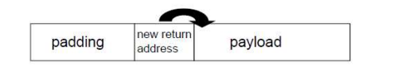
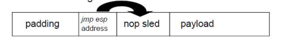

# Binary exploitation 1
Stack overflow and returned oriented programming

## Binary (executable files)
Binaries are files that can be executed by the OS. Binaries contain machine code instruction that the CPU understands. The binary file depends on the machine architecure and the OS.

Microsoft: Portable executable (PE32, PE32+)
Linux: ELF
Mac: MACH-O

## Compiling files
To make a binary executable file some source code has to be compiled.

For high-level programming languages such as Java or C# have intermediate byte code.

- Debug mode
    Variable and function names are saved (symbol table) and inserted into the binary. Used for debugging.
- Release mode
    Only the necessary details are compiled

- Static linking
    A copy of all the used external methods and variables are placed inside the binary (during compile time).
- Dynamic linking
    The external methods are not inside the binary it wll be placed into the virtual address space of the process when the binary is launched by the OS. Only the references are inside.

## Virtual Address Space

The OS generates a virtual address space for a process or processes on startup. Each process has its own Virtual Address Space where the process can use arbitrary (practically almost infinite) memory size

Benefits:
- Process can doesn't need to know anything about the real memory on the machine
- Optimization
- Sandboxing processes

OS translates between real memory and virtual memory for processes

Two main spaces.
 - User space <- consists of segments (code and data)
 - Kernel space

 ### Virtual Address Space - Segments

- text segment
    machine code
- data segment
    variables and constants

 ## The assembly language
The assembly language represents direct commands to be executed by the CPU. The CPU has registers for completing  and storing intermediate results of operations.

 ## The stack
 LIFO data structure

 The stack is a data structure that stores the data in a LIFO structure. There are special instructions that place data (push) and also instructions to pick and remove data (pop) from the stack. For example `push eax` places the value of `eax` on top of the stack and moves the stack pointer (esp/rsp) up. The pop-type instructions remove the top of the stack (move the stack pointer down) and copy the removed value to the specified registers. Special instructions such as push ad, popad place/pick up all the registers values in a specified order. Each thread has its own stack that makes data storing fast and reliable.

##  The stack frame - calling conventions

The stack frame is a continuos block inside the the stack that stores the data of a function that was called(called) by the caller. When a function is called the caller or callee (depends on the calling convention) prepares the stack for the function execution. The stack frame contains the following data:

- Function parameters
    In order to pass parameter to the function the parameters are placed on the stack (with some calling conventions such as *fastcall* it is placed inside the registers).
- The return address of the method
    In order to be able to return to the place where the function is called, the return address is placed.
- The local variables
    Local variables of the function die after exiting the function so they are stored inside the stack frame.
- The saved base pointer
    To have a reference to the local variables, the top of the stack is saved to the base pointer and the previous base pointer is stored inside the stack frame.

**Prior to the method execution the stack frame has to be prepared**

- The caller places the function parameters on the stack
- The caller places the return address on the stack
- The previous base pointer is placed on the stack as well
- The new base pointer is by copying the current stack pointer (mov ebp, esp)
- The top of the stack is modified to allocate place for the local variables

When the function exits:
- The instruction pointer jumps back to the calling instruction (ret)
- The saved base pointer has to be reset (ebp)
- THe stack frame has to be removed (The values are not removed on the stack pointer changes)

## Stack overflow exploit
The exploit should overrung the local variable and arrive to return pointer. The size of this (padding) depends on the size of the local variable and the stack layout, etc. It can be determined by debugging or using unique string such as "aaaaaaabbbbbbccccccddd..." and then obtain the address from the error message. The new return address can point to the beginning of the payload.

The solution is not so stable(int relies on the payload global address). Instead the following solution is used:

Exploits for command line executables can be generated easily using scripting languages such as Perl or Python.

### Available payloads

Shellstorm has a large payload database

## Stack overflow exploitation in Linux
THe first step is to identify the vulnerability. THat can be carried out by different type of fuzzing. Fuzzing is a process of providing various data (invalid to) to the application. A segmentation fault (access violation in Windows) indicates some errors.

## Return to libc

Operating systems provide several protectionsagainst exploitations. One of the most significat is the *noexecute* protection (DEP in Windows). Noexecute assignes permission to memory segments.

- Code segments (only read and execute, no write)
- Data segments (only read and write, no execute)

With *noexecute* the paylad on the stack cannot be executed anymore. The idea behind both return adn libc and ROP is to use the libc library (code reuse). If libc contains a code part that opens a shell then it can be used by redirecting the execution there (instead of using the address of *jmp esp*) Tools e.g *onegadget* can identify these specific code-parts in the Virtual Address Space
 ## Reading material

 http://folk.uio.no/laszloe/ctf/

## Return oriented programming
DEP stops us form executing code on the stack.

Is the technique of stitching together code already in the text segment to make up a payload. 

**Most common usage is to turn of DEP.**
