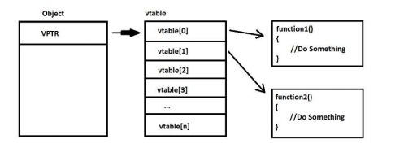

# Binary exploitation 2
Heap related vulnerabilities, bypassing
mitigations and protections

## The heap
The heap is a storage place where the processes allocate data blocks dynamically in runtime. There are several types of heap implementation. Each OS provides one or more own heap implementation.

Programs can create their own heap implementation (e.g Chrome) that are independent from the default OS solution. Because of the different solutions many custom heap allocators are available to tune heap performance for different usage patterns. The aim for the heap implementations are:

- alloc and free should be fast
- alloc should be the least wasteful
- alloc and free should be secure

The allocation andthe free has to be done by the programmer in case of native code.

**C example**
```c
ptr = (int*) malloc(100 * sizeof(int));
free(ptr);
```


## Windows basic heap management

The heap consists of chunks


## Heap overflow
The basic example of the heap overflow is related to the free and the reallocation of a chunk. Each chunk contains a pointer pointing to the previous and to the next chunk.

When a chunk is removed form the linked list the pointers of the neighbors are updated. If the attacker control's the header of the chunk to be removed he can control the next heap allocation


## Heap related vulnerabilities

- Use after free
    *Really dangerous, can result in remote code execution*
- Double free
    *Easier to exploit, also dangerous*


## OOP Vtable

A basic principle of OOP is polymorphism. Methods can be redefined for derived classes. Since the real type of an object is only decided in runtime, each object needs to have a virtual method table (vtable) that contains the object specific methods addresses.



In case of exploiting *Use after free* (dangling pointer) or *Double free* vulnerabilities the attacker can overwrite the vtable with a value pointing to an attack controlled memory region

## Heap spraying

Heap spraying is a payload delivery technique for heap related vulnerability exploitations. I we allocate an array with specific member size, then the heap will be full with our data. The heap allocation address are random, but since we use multiple copies form the same object is likely to have our data.

## Heap spraying example

Bypassing DEP(Data Execution Prevention)

Heap spraying is on the heap, ROP is on the stack. To solve use Stack pivot.

### Stack pivot
Stack pivot is a gadget that moves the stack to a different place.

Usage example:
1. Jump to a stack pivot
2. Fill the heap with ROP


## Linux heap exploitation
There are several heap exploitation techniques for Linux too: https://github.com/shellphish/how2heap


## Protections and mitigation
Althroug jeaå exploitation is complex and there are several protections and mitigations provied by the OS, the hardware and the compiler to make explotation more and more complicated:

- No execute protections (Data Execution Prevention in Windows)
- Address Space Layout Randomization (ASLR)
- Canary (Stack cookie)
- Position Independent Executables
- Fortify (buffer overflow checks)
- Relro (the Global Offset Table is readonly)

Althrough DEP +A SLR togheter look like a really strong protection:
- data cannot be executed as code because of the DEP pnly code reuse such as ROP and JOP (Jump Oriented Programming) can be used.
- The gadget addresses are not know if the segment addresses are randomized (ASLR)

Is that the perfect protection?

What about?
- Blind Return Oriented Programming (BROP)?
- Just in Time Return Oriented Programming (JIT-ROP)?
